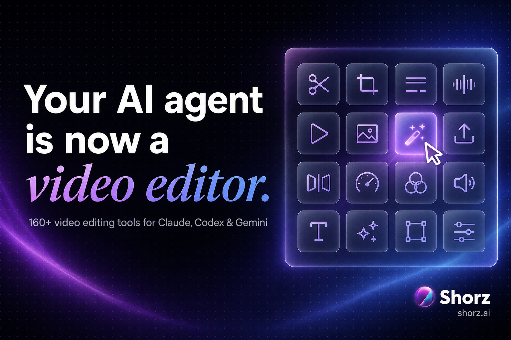

<div align="center">



# Claude video editing skill

**An Agent Skill that teaches Claude to edit real video.** Install it once and Claude Code, Claude Desktop or Cursor can auto-edit footage, clip long videos into shorts, add subtitles, generate avatars and thumbnails, and publish to YouTube and TikTok — through the [free Shorz desktop app](https://shorz.ai/download) and its built-in MCP server (160+ tools).

**[⬇ Download Shorz (free)](https://shorz.ai/download)** · [Full 160-tool catalog](https://github.com/Vossy/ai-video-agent) · [shorz.ai/tools/mcp](https://shorz.ai/tools/mcp)

</div>

---

## What's in the skill

MCP gives Claude the tools; **this skill teaches Claude how to use them well** — which panels to set in which order, how to check the cost of a generation before spending anything, how to run headless edits on loose files, and every gotcha we hit so your agent doesn't have to.

```
shorz-mcp/
├── SKILL.md                        # the operating manual
└── references/
    ├── project-workflows/          # end-to-end recipes: Auto Edit, Text-to-Video, Avatar, Podcast, Ads, Clipping
    ├── panel-workflows/            # subtitles, B-roll, titles, borders, overlays, audio, thumbnails…
    ├── headless-workflows/         # edit loose files with no project: trim, crop, concat, stock media, X research
    ├── guided-creation/            # interview flows that turn a vague idea into a finished video spec
    └── creative-strategy/          # content brainstorming for short-form
```

This is the same bundle every Shorz install ships — kept here so Claude users can install it straight from GitHub.

## Install (2 minutes)

**1. Get Shorz** — [free download](https://shorz.ai/download), Windows (macOS in progress). The MCP server ships inside the app; no separate package, no API keys.

**2. Connect Claude** — easiest: open **Connect AI Agent** in the Shorz header and click your client; Shorz writes the config and installs this skill for you. Or by hand:

```bash
claude mcp add --transport stdio --scope user shorz -- node "C:\Users\you\AppData\Local\Programs\Shorz\resources\mcp-server\index.js"
```

**3. Install the skill from this repo** (if you skipped the one-click):

```bash
git clone https://github.com/Vossy/claude-video-editing-skill
cp -r claude-video-editing-skill/shorz-mcp ~/.claude/skills/
```

For Claude Desktop: Settings → Capabilities → Skills → upload the `shorz-mcp` folder as a ZIP. For Cursor: copy to `~/.cursor/skills/`.

**4. Restart Claude and try it:**

> *"Clip podcast.mp4 into shorts with subtitles, then show me the results."*

> *"Trim ad.mp4 to 0:12–0:41, crop it to 9:16, and fade the audio out at the end."*

> *"Make an avatar video from headshot.jpg reading this script."*

## What can Claude actually do with it?

Everything the Shorz app can — 160 MCP tools across projects, panels, generation, publishing and headless file edits. **144 of the 160 tools are free to run**; AI generation tools use prepaid Shorz credits (1 credit = €0.01, no subscription, credits never expire), and the skill teaches Claude to check prices before spending. The complete catalog with per-tool cost labels lives in the [ai-video-agent repo](https://github.com/Vossy/ai-video-agent).

The app itself is free to download, with a real free tier: Auto Edit and Clipping, 4 videos a week, no card — and no watermark on anything, ever.

## FAQ

**Can Claude edit videos?**
Yes — with this skill and the Shorz app, Claude edits real files on your machine: trims, crops, subtitles, full auto-edits, and finished renders in your project folder. Nothing is uploaded to a cloud editor.

**Does this work with Claude Code?**
Yes, that's the primary target — plus Claude Desktop, Cursor, Codex, Antigravity and Gemini CLI (the skill format is portable; the Shorz app can install it for all of them).

**Is there a Claude video editing MCP?**
That's what powers this: the Shorz MCP server ships inside the free desktop app. This repo is the skill layer on top of it; the [full MCP tool catalog is here](https://github.com/Vossy/ai-video-agent).

**What does it cost?**
The app and this skill are free, and most tools (144/160) run at no cost. AI generation runs on prepaid credits — no subscription.

---

<div align="center">

*Vibe create videos at the speed of ideas.*

**[⬇ Get Shorz free](https://shorz.ai/download)**

</div>
